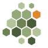

# The mark

`liken`'s icon is a patch of lichen, drawn as hexagonal tiles.

The pun holds at more than one level.

A lichen is not one organism. It is a fungus and a photosynthetic
partner (an alga or a cyanobacterium) living so closely that the
pair is named and classified as a single thing. That is what `liken`
is: the Linux kernel and `k3s`, each its own upstream project,
assembled so tightly that a machine boots the pair as one system.

Lichens are also pioneers. They are among the first living things to
take hold on bare rock, enduring drought, heat, and bare mineral where
nothing else will grow, and they are what begins to turn rock into
soil. `liken` starts from the same emptiness: a blank machine, bare
metal, nothing installed.

And a lichen is frugal by nature, thriving on almost nothing. `liken`
is built to run a real Kubernetes cluster inside a gigabyte of memory,
on hardware other systems would call too small.

## The tiles

Many crustose lichens grow flat against rock. As they age, and as
repeated wetting and drying shrinks the crust, the surface cracks into
small polygonal plates. Each plate is called an *areole*, and a
thallus built this way is *areolate*. The cracking forms a natural
mosaic of small plates. The icon reproduces that mosaic, one areole to
a tile.

Drawing the areoles as hexagons adds a second reference. The
Kubernetes community commonly uses the hexagon shape, from Helm's logo
to the backdrops of community talks. Because of this, the same
picture reads as lichen on rock to a botanist, and as a
Kubernetes shape to someone from that community.

One tile is orange, not green. Some of the most common rock lichens,
the *Xanthoria*, are a vivid orange. This single warm tile gives the
mark a focal point.

The tiles grow smaller toward one edge of the mark. This detail is an
invention and not biology: real areoles do not reliably shrink toward
the margin, because the cracking tends to start in the older center.
The gradient suggests a colony still spreading into bare rock, though
real lichens do not grow that way.

## The colors

The greens come from crustose lichens on stone, from deep moss to
pale sage. The one orange tile comes from *Xanthoria*.

| Swatch | Hex | Name |
| --- | --- | --- |
| Deep moss | `#4a5d3a` | darkest green |
| Mid sage | `#6e8352` | the body green |
| Light sage | `#93a877` | |
| Pale sage | `#b4c49a` | lightest green |
| Xanthoria | `#e0872f` | the one warm tile |

The mark has no background. It is transparent, so it works on both
light and dark surfaces. Every tile uses a flat color with no
gradients or effects. Because of this, the mark stays legible when
shrunk to a favicon, and it would print cleanly in one ink.

## The files

`liken.svg` is the original file; every other file in this list comes
from it. `make` derives the other files, and the repository also
commits them. Because of this, anyone can get a favicon or an avatar
without installing a rasterizer:

* `liken.svg` — the original file, for any use at any size.
* `favicon.ico` — a 16, 32, and 48 pixel raster image, for the browser
  tab. The website also serves the SVG file itself. Modern browsers
  prefer the SVG file and render it sharp at any size; `favicon.ico`
  is the fallback for browsers that cannot use the SVG file.
* `liken.png` — a 1024-pixel transparent export. Use it for a GitHub
  organization avatar or anywhere else that needs a raster image.

To rebuild these files, you need `rsvg-convert` (from librsvg) and
ImageMagick. Edit `liken.svg`, run `make`, and commit the files that
change.

## Sources

The biology in this document comes from standard lichenology sources:

* Irwin M. Brodo, Sylvia Duran Sharnoff, and Stephen Sharnoff,
  *Lichens of North America* (Yale University Press, 2001) — the
  standard field reference for the symbiosis and for growth forms.
* [British Lichen Society: Lichen
  Morphology](https://britishlichensociety.org.uk/learning/lichen-morphology)
  — areoles and the areolate crustose thallus.
* [Crustose lichen](https://en.wikipedia.org/wiki/Crustose_lichen) and
  [Lichen](https://en.wikipedia.org/wiki/Lichen), Wikipedia — the
  mycobiont/photobiont symbiosis and the pioneer role in primary
  succession, both with citations to the primary literature.
